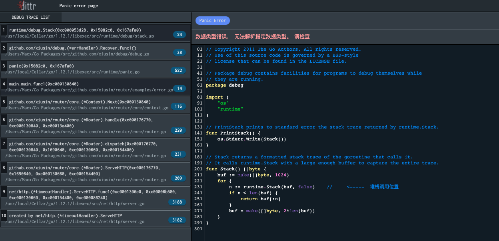

# xiusin/debug #

用于 router 开发打印错误调用堆栈信息

# 使用方法 #
```go
package main
import (
    "github.com/xiusin/debug"
    "github.com/xiusin/router"
)
func main()  {
    handler := router.New()
    handler.SetRecoverHandler(debug.Recover(app))
    handler.GET("/", func(c *core.Context) {
        panic("数据类型错误， 无法解析指定数据类型。 请检查")
    })
    handler.Run(router.Addr(":9528"))
}

```

# 效果图 #
