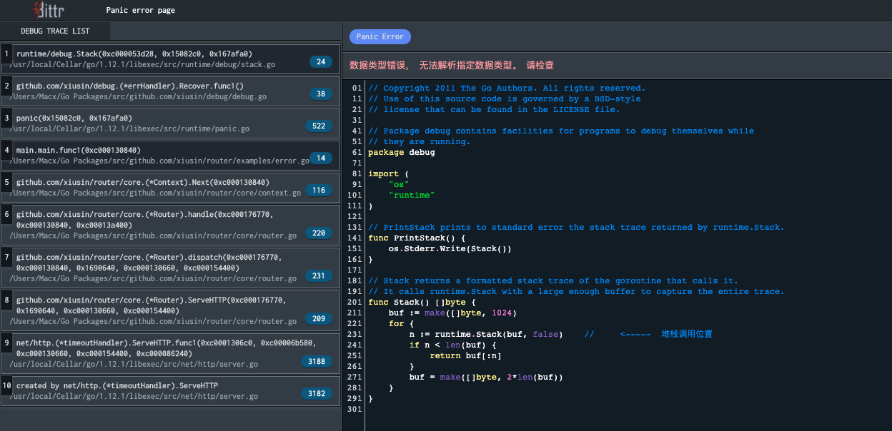

# xiusin/debug #

用于 router 开发打印错误调用堆栈信息




# 使用方法 #
```go
package main
import (
	"github.com/xiusin/debug"
	"github.com/xiusin/router/core"
)
func main()  {
    handler := core.NewRouter(nil)
    handler.ErrorHandler = debug.New(handler)
    handler.GET("/", func(c *core.Context) {
        panic("数据类型错误， 无法解析指定数据类型。 请检查")
    })
    handler.Serve()
}

```